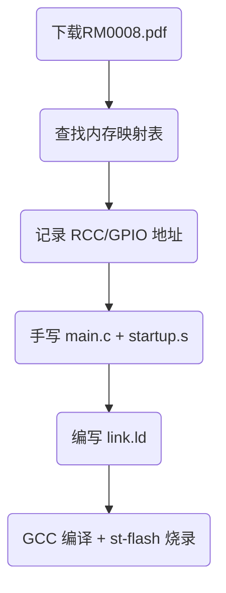

**关键词：**

CMSIS 是 Cortex Microcontroller Software Interface Standard 的缩写: ARM 公司给所有 Cortex-M 芯片（包括 STM32）制定的“统一编程规范”。


**不管使用的是寄存器编程、标准库、HAL库编程，程序运行的思路是不变量的**

> 适用任何 STM32 上用 纯寄存器 点亮 LED、驱动外设、写中断。
> 
> 时钟 → 使能 → 配置 → 操作 → 循环
>
> RCC  → APB2ENR → CRL/CRH → BSRR/BRR → while(1)
{: .prompt-tips }

### STM32编程步聚

寄存器：手敲代码配置，直接和寄存器打交道，要熟释芯片的编程手册。

标准库：基本的封装，把一系列的通用的寄存器操作标准化，提搞开发速度。

HAL库：高级封装，有可视化的基本配置，大大提高了胶水代码的编写。(当然，如果你不熟释MCU的执行运行原理，你还真不知道怎么配。)

#### 1、时钟配置
时钟是程序有序运行的根本，没有时钟，CPU就不能工作，因此在MCU编程时，第一步必须要配置时钟。

**时钟:**
|总线|全称|速度|用途|
|---|----|----|----|
|AHB|Advanced High-performance Bus|高速|- CPU、内存、DMA、Flash<br>- CPU 运行、数据搬运、快速访问内存|
|APB|Advanced Peripheral Bus|低速|外设（GPIO、UART、SPI、I2C 等）|

**STM32 时钟树（简版）**

    系统时钟 (SYSCLK)
     │
     ├──► AHB 总线 (高速) ──► CPU、SRAM、DMA、Flash
     │
     └──► APB 总线 (低速) ──► 外设
             ├── APB1 (≤36MHz) → TIM2~7、UART2~5、I2C1~2、SPI2
             └── APB2 (≤72MHz) → GPIOA~E、UART1、SPI1、ADC、TIM1


时钟常见的有：

**HSE(High Speed External):** 外部高速晶振(8MHz)

**HSI(High Speed Internal):** 内部RC振荡器

**LSE(Low Speed External):** 外部低速晶振(32.768kHz)

**LSI(Low Speed Internal):** 低速内部40KHz

HAL库的时钟配置(可以可视化配置)

系统时钟结构体：

```C
typedef struct
{
  uint32_t OscillatorType;  //振荡器类型(HSE、HSI、LSE、LSI)

#if defined(STM32F105xC) || defined(STM32F107xC)
  uint32_t Prediv1Source;       
#endif /* STM32F105xC || STM32F107xC */

  uint32_t HSEState;        //ON,OFF, BYPASS
  uint32_t HSEPredivValue;   //预测值    
  uint32_t LSEState;        // OFF,ON
  uint32_t HSIState;        // OFF,ON
  uint32_t HSICalibrationValue;   //校正值
  uint32_t LSIState;              
  RCC_PLLInitTypeDef PLL;         

#if defined(STM32F105xC) || defined(STM32F107xC)
  RCC_PLL2InitTypeDef PLL2;         
#endif /* STM32F105xC || STM32F107xC */
} RCC_OscInitTypeDef;


typedef struct
{
  uint32_t ClockType;      //    
  uint32_t SYSCLKSource;   //      
  uint32_t AHBCLKDivider;  //      
  uint32_t APB1CLKDivider; //
  uint32_t APB2CLKDivider; //      
} RCC_ClkInitTypeDef;
```

```C
HAL库配置自动生成的代码
void SystemClock_Config(void)
{
  // 系统时钟结构体
  RCC_OscInitTypeDef RCC_OscInitStruct = {0};
  RCC_ClkInitTypeDef RCC_ClkInitStruct = {0};

  // 系统时钟晶振类型
  RCC_OscInitStruct.OscillatorType = RCC_OSCILLATORTYPE_HSE;
  RCC_OscInitStruct.HSEState = RCC_HSE_ON;
  RCC_OscInitStruct.HSEPredivValue = RCC_HSE_PREDIV_DIV1;
  RCC_OscInitStruct.HSIState = RCC_HSI_ON;
  // 设置系统时钟的主频和倍频
  RCC_OscInitStruct.PLL.PLLState = RCC_PLL_ON;
  RCC_OscInitStruct.PLL.PLLSource = RCC_PLLSOURCE_HSE;
  RCC_OscInitStruct.PLL.PLLMUL = RCC_PLL_MUL9;
  if (HAL_RCC_OscConfig(&RCC_OscInitStruct) != HAL_OK)
  {
    Error_Handler();
  }

  /** 
  系统时钟总线
  Initializes the CPU, AHB and APB buses clocks
  */
  RCC_ClkInitStruct.ClockType = RCC_CLOCKTYPE_HCLK|RCC_CLOCKTYPE_SYSCLK
                              |RCC_CLOCKTYPE_PCLK1|RCC_CLOCKTYPE_PCLK2;
  RCC_ClkInitStruct.SYSCLKSource = RCC_SYSCLKSOURCE_PLLCLK;
  RCC_ClkInitStruct.AHBCLKDivider = RCC_SYSCLK_DIV1;
  RCC_ClkInitStruct.APB1CLKDivider = RCC_HCLK_DIV2;
  RCC_ClkInitStruct.APB2CLKDivider = RCC_HCLK_DIV1;

  if (HAL_RCC_ClockConfig(&RCC_ClkInitStruct, FLASH_LATENCY_2) != HAL_OK)
  {
    Error_Handler();
  }
}
```

#### 2、使能(通电开关)
打开某个功能 / 让某个外设开始工作，即“开开关” —— 给某个硬件模块上电、解锁、允许它运行

比如**STM32F103C8T6**有PA,PB,PC,PD四个区的pin脚定义，如果只使和PA0~PA15,中的任一个，只需要进行GPIOA的使能即可，所以使能的时候根据自己芯片使用的区域进行开启使能即可。具体有什么区，要根据芯片的数据手册。

当区域使能之后，则该区域的Pin脚默认的能力就具备了。

如HAL库开启各组使能：

        __HAL_RCC_GPIOA_CLK_ENABLE();  // 使能 GPIOA
        __HAL_RCC_GPIOB_CLK_ENABLE();  // 使能 GPIOB

寄存器写法：

        RCC->APB2ENR |= RCC_APB2ENR_IOPAEN;  // 使能 GPIOA 时钟
        RCC->APB2ENR |= RCC_APB2ENR_IOPBEN;  // 使能 GPIOA 时钟

__HAL_RCC_GPIOA_CLK_ENABLE() = RCC->APB2ENR |= RCC_APB2ENR_IOPAEN;

**四大类使能**

|类别|说明|数量|
|---|---|---|
|时钟使能|给外设通电|20+|
|外设功能使能|启动模块运行|10+|
|硬件模块使能|打开内部电路|3+|
|中断使能|允许 CPU 响应|60+|

**时钟使能在<font color="red">stm32f1xx_hal_rcc.h</font>定义**

|宏|说明|所属总线|
|---|---|---|
|__HAL_RCC_GPIOA_CLK_ENABLE()|使能 GPIOA|APB2|
|__HAL_RCC_GPIOB_CLK_ENABLE()|使能 GPIOB|APB2|
|__HAL_RCC_GPIOC_CLK_ENABLE()|使能 GPIOC|APB2|
|__HAL_RCC_GPIOD_CLK_ENABLE()|使能 GPIOD|APB2|
|__HAL_RCC_GPIOE_CLK_ENABLE()|使能 GPIOE|APB2|
|__HAL_RCC_GPIOF_CLK_ENABLE()|使能 GPIOF|APB2|
|__HAL_RCC_GPIOG_CLK_ENABLE()|使能 GPIOG|APB2|
|__HAL_RCC_AFIO_CLK_ENABLE()|使能复用 IO|APB2|
|__HAL_RCC_USART1_CLK_ENABLE()|使能串口1|APB2|
|__HAL_RCC_USART2_CLK_ENABLE()|使能串口2|APB1|
|__HAL_RCC_USART3_CLK_ENABLE()|使能串口3|APB1|
|__HAL_RCC_UART4_CLK_ENABLE()|使能串口4|APB1|
|__HAL_RCC_UART5_CLK_ENABLE()|使能串口5|APB1|
|__HAL_RCC_SPI1_CLK_ENABLE()|使能 SPI1|APB2|
|__HAL_RCC_SPI2_CLK_ENABLE()|使能 SPI2|APB1|
|__HAL_RCC_I2C1_CLK_ENABLE()|使能 I2C1|APB1|
|__HAL_RCC_I2C2_CLK_ENABLE()|使能 I2C2|APB1|
|__HAL_RCC_TIM1_CLK_ENABLE()|使能高级定时器1|APB2|
|__HAL_RCC_TIM2_CLK_ENABLE()|使能定时器2|APB1|
|__HAL_RCC_TIM3_CLK_ENABLE()|使能定时器3|APB1|
|__HAL_RCC_TIM4_CLK_ENABLE()|使能定时器4|APB1|
|__HAL_RCC_ADC1_CLK_ENABLE()|使能 ADC1|APB2|
|__HAL_RCC_DMA1_CLK_ENABLE()|使能 DMA1|AHB|
|__HAL_RCC_DMA2_CLK_ENABLE()|使能 DMA2|AHB|
|__HAL_RCC_BKP_CLK_ENABLE()|使能备份寄存器|APB1|
|__HAL_RCC_PWR_CLK_ENABLE()|使能电源控制|APB1|

**外设功能使能(启动模块)**

|宏|说明|
|---|---|
|SPI1->CR1| SPI_CR1_SPE;|
|USART1->CR1| USART_CR1_UE;|
|ADC1->CR2| ADC_CR2_ADON;|

**中断使能（NVIC）**
不同的芯片支持的数数量是不一样的，查手册
如：

|宏|说明|
|--|--|
|NVIC_EnableIRQ(USART1_IRQn);|使能串口1中断|
|NVIC_EnableIRQ(EXTI0_IRQn);|使能外部中断0|
|NVIC_EnableIRQ(TIM2_IRQn);|使能定时器2中断|
|...|...|


举例：开启时间使能

|寄存器写法|标准库写法|HAL库写法|
|---|---|---|
|RCC->APB2ENR \|= RCC_APB2ENR_IOPAEN;|RCC_APB2PeriphClockCmd(RCC_APB2Periph_GPIOA, ENABLE);|__HAL_RCC_GPIOA_CLK_ENABLE();|


#### 3、配置

配置的要想生效，必须使配置的Pin脚区域使能(即通电), 比如配置PC13脚来点亮灯，但没有进行__HAL_RCC_<font color="red">GPIOC</font>_CLK_ENABLE(); 开启则怎么配置也不可能亮灯，因为此区不通电呢。

所库的配置就是只针对选用的Pin脚不同的作用来进行配置。如当设为GPIO_OUTPUT时，常见的有

```c
typedef struct
{
  uint32_t Pin; //Pin脚的定义，如GPIO_PIN_13则规格说明书中的13脚，不区分ABCD区域

  uint32_t Mode; //模式 1、推挽输 2、或开漏输出(I2C通信息使用时)     

  uint32_t Pull;  //1、悬空，2、上拉电阻(即没有输入时是高电平)，3、下拉电阻(低电平)    

  uint32_t Speed; //速度，低、中、高
} GPIO_InitTypeDef;
```

```c

/// 这里使用C区的13脚作为点亮灯的输出脚（因为开发版的PC13正好是LED的负极相接）
#define LED0_Pin GPIO_PIN_13
#define LED0_GPIO_Port GPIOC

GPIO_InitTypeDef GPIO_InitStruct = {0};
// 初始化为高电平(则初始态灯灭)
HAL_GPIO_WritePin(LED0_GPIO_Port, LED0_Pin, GPIO_PIN_SET);

// OUTPUT配置
GPIO_InitStruct.Pin = LED0_Pin; //指定的Pin脚
GPIO_InitStruct.Mode = GPIO_MODE_OUTPUT_PP; //Pull Push 即推挽输出
GPIO_InitStruct.Pull = GPIO_PULLUP; //设置内部上拉电阻
GPIO_InitStruct.Speed = GPIO_SPEED_FREQ_LOW; //低速
// 设置配置，使配置生效
HAL_GPIO_Init(LED0_GPIO_Port, &GPIO_InitStruct);

```

#### 4、操作

操作是指进行具体的程序指令来完成需求。

#### 5、循环

就是让程序不停的执行指令，直到断电。


### 完全裸机编程(寄存器编程)

通常参考RM，PM手册，如STM32F103C8T6

|文档|用途|下载链接|
|---|---|----|
|RM0008（参考手册）|所有外设寄存器地址、位定义|ST 官网|
|PM0075（编程手册）|Cortex-M3 内核寄存器(NVIC、SCB)|同上或单独下载|
|STM32F103 Datasheet|引脚定义、电气特性|官网|
|Cortex-M3 Technical Reference Manual|指令集、异常模型|官网|


流程图：



